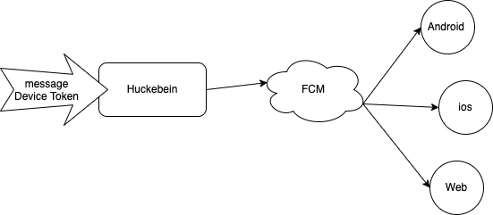

# Huckebein

poc apply cloud messaging server use golang by firebase

## System work Follow



## Deploy Guide

**Setting environment variable**

```shell
export GOOGLE_APPLICATION_CREDENTIALS="<YOUR_FIREBASE_ADMIN_SDK_CONFIG_File>" 
```

**Run**

```shell
go run cmd/main.go   
```

## REFERENCE

1. [Firebase Cloud Messaging](https://firebase.google.com/docs/cloud-messaging/)